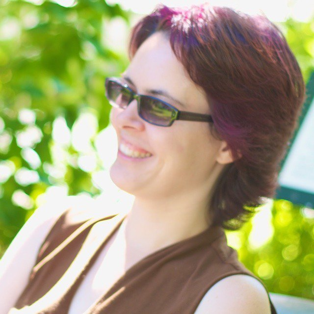

# Schemas for Humans

Social app development challenges us how to code for users' personal world. Users are giving push-back to ill-fitted assumptions about their identity — including name, gender, sexual orientation, important relationships, and other attributes they value.

How can we balance users' realities with an app's business requirements?

Facebook, Google+, and others are grappling with these questions. Resilient approaches arise from an app's own foundation. Discover schemas' influence over codebase, UX, and development itself. Learn how we can use schemes to both inspire users and generate data we need as developers.

## Resources
A different version of this talk was presented at GoGaRuCo 2012. [Video, slides, and audience notes are available via Lanyrd.](http://lanyrd.com/2012/gogaruco/sydft/).

See [cczona.com/talks](http://cczona.com/talks/) for abstracts and slides for more talks.

## Reviews
  > "Carina Zona challenged us to rethink our schemas to better reflect the real world. Her insightful session highlighted the assumptions we make about the world, particularly about relationships and sexual identity, through our technical decisions. When designing our applications, we should focus on modeling the world as it is, and worry less about how we’ll store and query the data. We can extrapolate out this idea further when thinking about software design. Instead of viewing our applications as interfaces to a datastore, they should be interfaces to our world. Storing the data is the easy part, writing our applications so that they are flexible to our dynamic world is much harder."
—[New Relic](http://blog.newrelic.com/2012/10/22/the-who-and-what-of-gogaruco-2012)

  > "Inspirational challenges to the community"
—[Alex Chaffee](https://twitter.com/alexch/status/248118835130019843)

  > "Loved, loved, loved your talk. You walked right through the issue and sorted it out definitively. Thank you"
  —[Jack Danger Canty](https://twitter.com/jackdanger/statuses/247231593108873216)

---

# Speaker

## Carina C. Zona

[Carina C. Zona](http://cczona.com) is a San Francisco web developer and a senior organizer of [RailsBridge](http://railsbridge.org) core team. She is a tech educator for outreach groups including RailsBridge, [RailsGirls](http://railsgirls.com/), [PyLadies](http://www.pyladies.com/), [Girl Develop It](http://girldevelopit.com/). She is also a certified sex educator. She thinks a lot about how these overlap. 

- [My website](http://cczona.com/)
- [My Twitter](https://twitter.com/cczona)
- [Past talks' slides & video](http://cczona.com/talks/)
